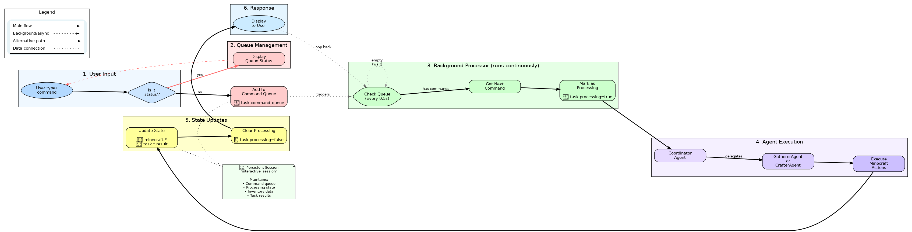

# Minecraft ADK Guild

A multi-agent AI system for Minecraft using Google ADK patterns. The project demonstrates specialized agents that coordinate to accomplish tasks like resource gathering and item crafting.

## 🏗️ Architecture

```
User → main.py → CoordinatorAgent → [GathererAgent, CrafterAgent]
                      ↓                     ↓              ↓
                 session.state         Mineflayer      Mineflayer
                                         tools           tools
```

### Core Components

1. **Agent Layer (Python)**
   - **CoordinatorAgent**: Handles user interaction and task delegation
   - **GathererAgent**: Specialized in resource collection
   - **CrafterAgent**: Specialized in item crafting
   - Uses Google ADK for multi-agent orchestration

2. **Bridge Layer**
   - **BridgeManager**: Python → JavaScript command execution
   - WebSocket communication on port 8765

3. **Minecraft Layer (JavaScript)**
   - **Mineflayer Bot**: Direct Minecraft server interaction
   - **Pathfinding**: Navigation and movement
   - **Event System**: Real-time world updates

### Interactive Agent Loop Architecture



The interactive mode implements a persistent session with command queuing through six distinct stages:

1. **User Input**: Commands are entered naturally and checked for special operations (like 'status')
2. **Queue Management**: Commands are added to a persistent queue stored in session state
3. **Background Processor**: A continuous loop checks the queue every 0.5 seconds for new commands
4. **Agent Execution**: The Coordinator delegates tasks to specialized sub-agents (Gatherer/Crafter)
5. **State Updates**: All results and game state are saved to the persistent session
6. **Response Display**: Results are shown to the user as commands complete

The entire flow maintains a single persistent session throughout, ensuring agents remember previous interactions and can build upon past actions.

## 🚀 Quick Start

### Prerequisites
- Python 3.11+
- Node.js 18+
- Minecraft Java Edition server
- Google AI API key (for Gemini)

### Installation

```bash
# Clone repository
git clone https://github.com/your-repo/minecraft-adk-guild.git
cd minecraft-adk-guild

# Install dependencies
npm install
pip install -e .

# Configure environment
cp .env.example .env
# Edit .env with your API key and server details
```

### Usage

```bash
# Start Minecraft bot
node src/minecraft/bot.js

# In another terminal, run agent commands
python main.py "check inventory"
python main.py "gather 3 oak logs"
python main.py "craft a wooden pickaxe"
```

Interactive mode with persistent session:
```bash
python main.py --interactive

# In interactive mode:
Minecraft Agent> gather wood
Minecraft Agent> craft planks
Minecraft Agent> status  # View queue status
Minecraft Agent> exit    # Quit
```

## 📁 Project Structure

```
src/
├── agents/          # Multi-agent implementations
├── bridge/          # Python-JavaScript communication
├── minecraft/       # Mineflayer bot and events
└── tools/           # ADK tool wrappers for Minecraft
```

## 🔧 Configuration

Environment variables (`.env`):
```bash
MINECRAFT_AGENT_GOOGLE_AI_API_KEY=your_key_here
MINECRAFT_AGENT_MINECRAFT_HOST=localhost
MINECRAFT_AGENT_MINECRAFT_PORT=25565
MINECRAFT_AGENT_BOT_USERNAME=MinecraftAgent
MINECRAFT_AGENT_LOG_LEVEL=INFO
```

### Logging

The system uses `structlog` for structured logging with both console and file output:

- **Console**: Pretty-printed, colored output for development
- **File**: JSON-formatted logs in `logs/` directory for parsing and analysis
- **Log files**: Auto-generated with timestamp (e.g., `minecraft_agent_20240327_143022.log`)
- **Log level**: Controlled via `MINECRAFT_AGENT_LOG_LEVEL` environment variable

Example log output:
```json
{
  "event": "User action completed",
  "timestamp": "2024-03-27T14:30:22.123456",
  "level": "info",
  "logger": "src.agents.gatherer_agent",
  "user_id": "player123",
  "action": "gather_wood",
  "items_collected": 5,
  "duration_seconds": 45.3
}
```

## ☁️ GCP Deployment

This project includes scripts for deploying to Google Cloud Platform:

### Quick Deployment

```bash
# Validate setup
python -m deploy.validate_setup

# Install deployment dependencies
pip install -e ".[deploy]"

# Run deployment (in order)
python -m deploy.setup_project      # Enable APIs, create resources
python -m deploy.deploy_minecraft   # Deploy Minecraft server
python -m deploy.setup_secrets      # Configure secrets
python -m deploy.deploy_agent       # Deploy bot to Agent Engine
python -m deploy.setup_monitoring   # Add basic monitoring
```

### What Gets Deployed

- **Minecraft Server**: Compute Engine instance with static IP
- **Bot System**: Agent Engine for scalable agent hosting  
- **Monitoring**: Basic uptime checks and logging
- **CI/CD**: Cloud Build for automated deployments

See [deploy/README.md](deploy/README.md) for detailed deployment instructions.

### Estimated Costs

- ~$40-50/month for MVP deployment
- Minecraft server: ~$30/month (e2-medium)
- Static IP: ~$7/month
- Agent Engine: Pay-per-use (minimal for testing)