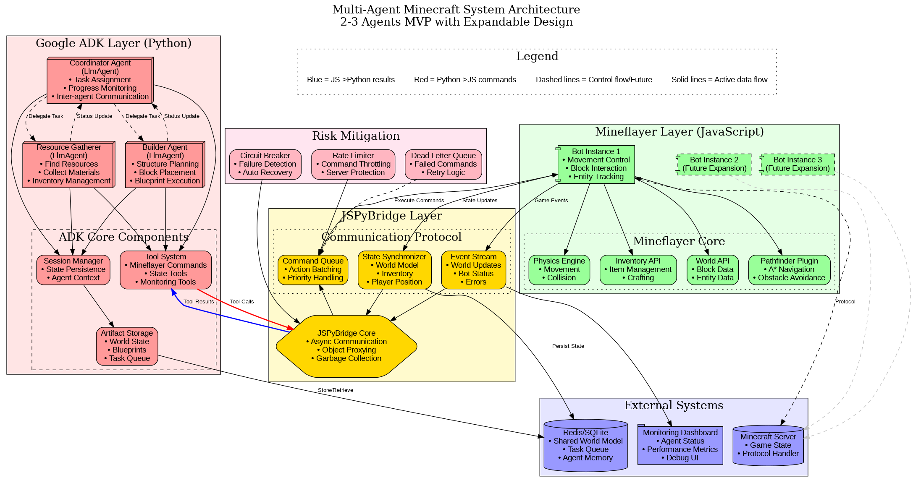
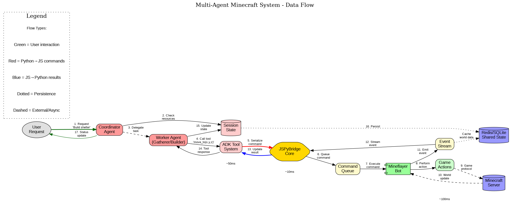

# Multi-Agent Minecraft System

A sophisticated multi-agent system for Minecraft automation using Google ADK, Mineflayer, and JSPyBridge. This project demonstrates how to build intelligent, collaborative agents that can gather resources, construct buildings, and coordinate complex tasks in Minecraft.

## 🏗️ Architecture Overview



The system consists of three main layers connected through JSPyBridge:

### 1. **ADK Layer (Python)** - Intelligence & Coordination
- **Coordinator Agent**: Orchestrates tasks and monitors progress
- **Resource Gatherer**: Autonomously finds and collects materials
- **Builder Agent**: Constructs structures from blueprints
- Utilizes Google ADK's LLM agents, session management, and tool system

### 2. **Bridge Layer** - Seamless Communication
- **JSPyBridge**: Enables Python agents to control JavaScript bots
- **Command Queue**: Manages action sequencing and prioritization
- **State Synchronizer**: Maintains consistent world model across languages

### 3. **Mineflayer Layer (JavaScript)** - Game Interaction
- Direct Minecraft protocol implementation
- Pathfinding, physics, and inventory management
- Real-time event handling and world updates

## 🔄 Data Flow



The diagram above illustrates how data flows through the system:
1. **User requests** are processed by the Coordinator Agent
2. **Commands flow** from Python agents through JSPyBridge to Mineflayer
3. **Game events** stream back through the bridge to update agent state
4. **State persistence** ensures continuity across sessions

## 🚀 Key Features

- **Multi-Agent Coordination**: Agents work together on complex tasks
- **Intelligent Decision Making**: LLM-powered agents adapt to situations
- **Fault Tolerance**: Automatic recovery from failures and disconnections
- **Scalable Architecture**: Easy to add new agents and capabilities
- **Real-time Monitoring**: Dashboard for agent status and performance

## 📋 Project Plan Summary

### Development Phases

#### Phase 1: Infrastructure Foundation (Week 1)
- Core bridge setup and communication protocol
- Single agent prototype with basic movements
- Development environment and monitoring

#### Phase 2: Multi-Agent Coordination (Week 2)
- Implement all three agent types
- Inter-agent communication and shared state
- World model and resource tracking

#### Phase 3: Complex Behaviors (Week 3)
- Advanced coordination patterns
- Error recovery and checkpointing
- Performance optimization

### POC Success Criteria

✅ **Resource Gathering**: Agent collects 64 wood blocks autonomously  
✅ **Construction**: Builder creates 5x5x3 shelter from blueprint  
✅ **Coordination**: Agents delegate tasks and share resources  
✅ **Recovery**: System handles failures gracefully

## 🛠️ Technical Stack

- **Google ADK**: Agent orchestration and LLM integration
- **Mineflayer**: Minecraft bot framework (JavaScript)
- **JSPyBridge**: Python-JavaScript interoperability
- **Redis/SQLite**: Shared state and persistence
- **Docker**: Development environment

## 🔧 Risk Mitigation

### 1. Bridge Latency
- **Solution**: Command batching and predictive execution
- **Target**: <100ms p95 latency

### 2. State Synchronization
- **Solution**: Event sourcing and optimistic locking
- **Target**: Zero state conflicts

### 3. Session Management
- **Solution**: External state storage and rotation
- **Target**: 24+ hour continuous operation

## 🚦 Getting Started

### Prerequisites
- Python 3.8+
- Node.js 18+
- Minecraft Java Edition server
- Docker (optional)

### Installation
```bash
# Clone the repository
git clone https://github.com/yourusername/minecraft-multiagent

# Install Python dependencies
pip install google-adk javascript

# Install Node.js dependencies
npm install mineflayer pythonia mineflayer-pathfinder

# Start Minecraft server
docker-compose up minecraft-server
```

### Quick Start
```python
# Example: Simple resource gathering
from minecraft_agents import ResourceGatherer

gatherer = ResourceGatherer()
await gatherer.collect_wood(amount=64)
```

## 📊 Monitoring

The system includes a real-time dashboard showing:
- Agent status and current tasks
- Resource inventory
- Performance metrics
- Command history

## 🔮 Future Enhancements

- **Combat Agent**: Defend against threats
- **Farming Agent**: Automated food production  
- **Trading Agent**: Economic interactions
- **Voice Control**: Natural language commands
- **Multi-server**: Coordinate across servers

## 📚 Documentation

- [Detailed Project Plan](PROJECT_PLAN.md)
- [API Reference](docs/api.md)
- [Agent Development Guide](docs/agents.md)
- [Troubleshooting](docs/troubleshooting.md)

## 🤝 Contributing

We welcome contributions! Please see our [Contributing Guide](CONTRIBUTING.md) for details.

## 📄 License

This project is licensed under the MIT License - see the [LICENSE](LICENSE) file for details.

## 🙏 Acknowledgments

- Google ADK team for the agent framework
- PrismarineJS for Mineflayer
- extremeheat for JSPyBridge

---

Built with ❤️ for the Minecraft automation community