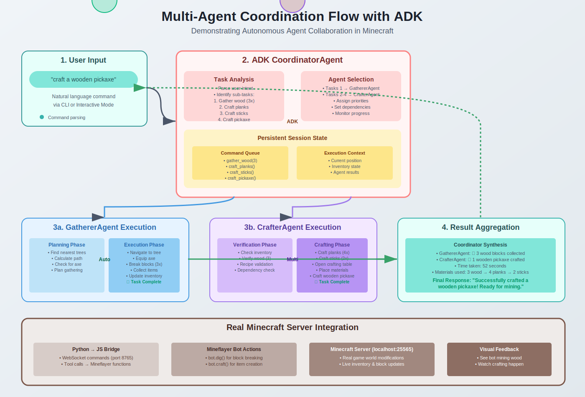

# 🏰 Minecraft ADK Guild

**AI agents working together like a medieval guild to conquer Minecraft tasks** 🤖⚔️

[](https://google.github.io/adk-docs/)
[](https://github.com/google/adk-docs/blob/main/docs/agents/multi-agents.md)
[](https://minecraft.net)
[](https://python.org)

<div align="center">
  
  <p><i>Watch AI agents collaborate to gather resources and craft items autonomously</i></p>
</div>

### 🎯 Key Features
- **3 Specialized Agents** working in perfect coordination through Google ADK
- **<3s** response time for simple tasks, scales with complexity
- **Smart dependency resolution** for multi-step crafting workflows
- **Pattern matching** for flexible resource discovery (e.g., any wood type)
- **AI-driven decisions** using real Minecraft world data provided through specialized tools

## 🎯 The Challenge

Minecraft players face complex multi-step tasks daily:
- 🪵 "I need sticks" → But first need planks → But first need logs → Must find trees
- ⛏️ "Craft a pickaxe" → Need sticks + planks + correct pattern → Multiple dependencies
- 🏗️ "Build a house" → Gather materials → Clear land → Plan layout → Execute

**Traditional bots fail because they can't plan, adapt, or coordinate complex workflows.**

## 💡 Our Solution: AI Agent Guild

We've created specialized AI agents that work together like a medieval guild:

- 🎭 **Coordinator Agent**: The guild master who understands requests and delegates tasks
- 🌲 **Gatherer Agent**: The resource specialist who finds and collects materials  
- 🔨 **Crafter Agent**: The artisan who transforms materials into tools and items

Using **Google ADK's AgentTool pattern**, these agents collaborate through shared state to accomplish complex goals that would be impossible for a single agent.

## 🚀 See It In Action

```bash
# Simple commands trigger complex multi-agent workflows
python main.py "craft a wooden pickaxe"

# Example output:
💭 [CoordinatorAgent] Thinking: I need to craft a wooden pickaxe...
🔧 [CoordinatorAgent] Calling tool: get_inventory
✓ [CoordinatorAgent] Tool get_inventory completed in 217ms
→ [CoordinatorAgent] Delegating to GathererAgent
🌲 [GathererAgent] Searching for oak_log within 32 blocks...
✓ [GathererAgent] Found 15 oak logs, gathering 3...
→ [CoordinatorAgent] Delegating to CrafterAgent  
🔨 [CrafterAgent] Crafting oak_planks from oak_log...
✓ [CrafterAgent] Successfully crafted 12 oak_planks
🔨 [CrafterAgent] Crafting stick from oak_planks...
✓ [CrafterAgent] Successfully crafted 8 sticks
🔨 [CrafterAgent] Crafting wooden_pickaxe...
✓ [CrafterAgent] Successfully crafted 1 wooden_pickaxe

✅ Successfully crafted a wooden pickaxe! It's now in your inventory.
```

### 🎮 Interactive Mode - Persistent AI Memory

```bash
python main.py --interactive

Minecraft Agent> gather 10 oak logs
✓ Gathered 10 oak logs near position (123, 64, -456)

Minecraft Agent> craft planks  
✓ Crafted 40 oak planks from 10 oak logs

Minecraft Agent> craft sticks
✓ Crafted 32 sticks from 8 oak planks

Minecraft Agent> what's in my inventory?
Your inventory contains: 32 oak planks, 32 sticks
```

## 🏗️ Architecture: Three-Layer Intelligence


### 💡 ADK Integration Highlights

- **AgentTool Pattern**: Sub-agents (Gatherer, Crafter) are exposed as tools to the Coordinator
- **Structured Outputs**: Each agent returns results via `output_key` to session state
- **Minecraft Data Access**: Real game data (blocks, items, recipes) provided through MinecraftDataService (ref: [minecraft-data](https://github.com/PrismarineJS/minecraft-data))
- **Tool Wrapping**: Mineflayer bot functions wrapped as ADK-compatible async tools
- **Session Persistence**: State maintained across all interactions in a session

### 🧠 Agent Intelligence Layers

1. **🎯 Coordinator Agent** (Strategic Layer)
   - Natural language understanding
   - Multi-step planning and dependency resolution
   - Sub-agent orchestration
   - Result interpretation and user communication

2. **🌲 Gatherer Agent** (Resource Layer)
   - Pattern-based block finding (`*_log` finds all wood types)
   - Pathfinding and navigation
   - Efficient resource collection
   - Inventory management

3. **🔨 Crafter Agent** (Creation Layer)
   - Recipe knowledge and validation
   - Material requirement checking
   - Multi-step crafting workflows
   - Success/failure reporting

### 🌉 Bridge Innovation

Our **Python↔JavaScript Bridge** enables:
- Real-time bidirectional communication
- Event streaming from game to agents
- Command queuing and prioritization
- Automatic reconnection and error recovery

## ✨ Key Features

### 🤖 Advanced Multi-Agent Coordination
- **AgentTool Pattern**: Sub-agents are tools that return structured results
- **Shared State**: Agents communicate through persistent session state
- **Smart Delegation**: Coordinator knows which agent to use for each task
- **Result Verification**: Never assumes success - always checks actual outcomes

### 🎯 Intelligent Task Planning
- **Dependency Resolution**: Automatically figures out prerequisite tasks
- **Pattern Matching**: `find_blocks("*_log")` finds any type of wood
- **Context Awareness**: Understands "nearby", "there", relative directions
- **Failure Recovery**: Graceful handling with helpful suggestions

### 🔧 Production-Ready Infrastructure
- **Structured Logging**: JSON logs for analysis, colored console for development
- **Configuration Management**: Environment-based config with validation
- **Error Boundaries**: Comprehensive error handling at every layer
- **Type Safety**: Pydantic models for internal data validation
- **Cloud Deployment**: Successfully deployed to GCP (see [`feature/gcp-deployment`](https://github.com/Paradiddle131/Minecraft-ADK-Guild/tree/feature/gcp-deployment) branch)
  - Agents deployed on Google Agent Engine ✅
  - Minecraft server on Compute Engine ✅
  - Bot connectivity issues prevented merging (Users could connect to the server but the bot couldn't)

### 🌐 Multiple Interfaces
- **CLI Mode**: One-off commands for scripts
- **Interactive Mode**: Persistent session with command history
- **Web UI**: Test agents without Minecraft server (via `adk web`)
- **API Mode**: RESTful endpoints for external integration

## 📁 Project Structure

```
minecraft-adk-guild/
├── minecraft_coordinator/   # Guild master agent
│   ├── agent.py            # AgentTool orchestration
│   ├── prompt.py           # Coordination instructions
│   └── callbacks.py        # Logging callbacks
├── minecraft_gatherer/      # Resource specialist agent
│   ├── agent.py            # Collection logic
│   └── prompt.py           # Gathering instructions
├── minecraft_crafter/       # Crafting specialist agent
│   ├── agent.py            # Recipe execution
│   └── prompt.py           # Crafting instructions
├── src/
│   ├── bridge/             # Python↔JavaScript communication
│   ├── minecraft/          # Mineflayer bot implementation
│   ├── tools/              # ADK tool wrappers
│   └── minecraft_data_service.py  # Game data lookups
├── main.py                 # Entry point for CLI/interactive mode
└── docs/                   # Documentation and diagrams
```

## 📦 Installation

### Prerequisites
- Python 3.11+
- Node.js 18+
- Minecraft Java Edition 1.21+ (only needed if you want to join the same game yourself)
- Google AI API Key ([Get one here](https://makersuite.google.com/app/apikey))

### Quick Start

```bash
# Clone the repository
git clone https://github.com/yourusername/minecraft-adk-guild.git
cd minecraft-adk-guild

# Install dependencies
npm install
pip install -e .

# Configure environment
cp .env.example .env
# Edit .env with your API key
```

### 🧪 Try Agent Logic Without Minecraft Server

```bash
# Test agent reasoning with ADK Web UI
adk web

# Open http://localhost:8000
# Select "minecraft_coordinator" from dropdown
# Try commands like "craft a pickaxe" to see agent coordination
```

### 🎮 With Minecraft Server

```bash
# Start your Minecraft server (1.21+)
# Then run:
python main.py "check inventory"
```

### 🐳 Docker Installation

```bash
# Build and run with Docker Compose
docker-compose up -d

# Execute commands
docker-compose exec bot python main.py "gather wood"
```

## 🎮 Usage Examples

### Basic Commands
```bash
# Inventory management
python main.py "check inventory"
python main.py "toss 10 dirt"

# Resource gathering
python main.py "gather wood"        # Finds any type of logs
python main.py "gather 5 oak logs"  # Specific type
python main.py "mine stone"         # Searches underground

# Crafting operations
python main.py "craft sticks"       # Handles dependencies
python main.py "craft wooden sword" # Multi-step crafting

# World interaction
python main.py "move to 100 64 -200"
python main.py "remove the stairs nearby"  # Contextual understanding
```

### Advanced Workflows
```python
# Complex multi-step task
python main.py "prepare for mining"
# Agents will:
# 1. Check if you have a pickaxe
# 2. If not, gather wood
# 3. Craft planks and sticks  
# 4. Craft wooden pickaxe
# 5. Report ready status
```

## 🔬 Technical Deep Dive

### Google ADK Patterns Used

1. **AgentTool Pattern**
   ```python
   tools = [
       AgentTool(agent=gatherer_agent),
       AgentTool(agent=crafter_agent),
   ]
   ```

2. **Structured Output with State**
   ```python
   gatherer = LlmAgent(
       name="GathererAgent",
       output_key="gathering_result",  # Results go to state
       instruction=GATHERER_PROMPT,
   )
   ```

3. **Session Persistence**
   ```python
   session_service = InMemorySessionService()
   # State persists across all commands in session
   ```

### Performance & Technical Metrics

- ⚡ **Response Time**: <3s for simple tasks, scales with complexity
- 🎯 **Pathfinding**: Handles 100+ block distances efficiently  
- 📊 **State Management**: O(1) state access with ADK session state
- 🔄 **Concurrent Operations**: WebSocket + async for parallel tasks
- 🧠 **Context Window**: Efficient prompt design keeps tokens <2K per request
- 📈 **Scalability**: Add new agents without modifying existing ones
- 🌐 **Real Game Data**: 3000+ Minecraft items/blocks/recipes available to agents thanks to [minecraft-data](https://github.com/PrismarineJS/minecraft-data)

## 🔄 Deep Dive: Interactive Agent Loop Architecture


The interactive mode implements a sophisticated command processing pipeline that maintains persistent state across all interactions:

### How It Works

1. **User Input Stage**: Commands enter through a non-blocking input thread, allowing the system to process previous commands while accepting new ones.

2. **Command Queue**: All commands are added to an async queue (`asyncio.Queue`), ensuring proper ordering and preventing race conditions.

3. **Background Processor**: A dedicated coroutine continuously monitors the queue, pulling commands as they arrive and processing them sequentially.

4. **Agent Execution**: The Coordinator Agent receives each command with full session context, enabling it to reference previous actions and maintain conversation continuity.

5. **State Persistence**: Every tool execution automatically updates the ADK session state, creating a growing knowledge base throughout the session.

6. **Response Display**: Results stream back to the user in real-time, with agent thoughts and tool calls visible for transparency.

### Key Benefits

- **Non-blocking**: Users can type new commands while previous ones process
- **Ordered Execution**: Commands always execute in the order received
- **State Continuity**: "craft planks" followed by "craft sticks" works seamlessly
- **Error Recovery**: Failed commands don't crash the session
- **Resource Efficiency**: Single bot connection serves entire session


## 🛠️ Extending the Guild

Add new specialist agents easily:

```python
# Create a new specialist
builder_agent = LlmAgent(
    name="BuilderAgent",
    instruction="You are a construction specialist...",
    output_key="building_result",
    tools=building_tools,
)

# Add to coordinator's toolkit
tools.append(AgentTool(agent=builder_agent))
```


## 🤝 Contributing

### Development Setup

```bash
# Install dev dependencies
pip install -e ".[dev]"

# Run tests
pytest

# Run linting
black . && ruff check .

# Test with ADK Web UI
adk web
```

## 📈 Future Vision

- 🏰 **Building Agent**: Construct structures from blueprints
- 🛡️ **Combat Agent**: Defend against mobs
- 🌾 **Farming Agent**: Automate crop cultivation
- 🔍 **Explorer Agent**: Map new territories
- 🤝 **Social Agent**: Interact with other players

## 📄 License

This project is licensed under the MIT License - see [LICENSE](LICENSE) for details.

## 🙏 Acknowledgments

- Google ADK team for the powerful multi-agent framework
- Mineflayer community for the excellent Minecraft bot library
- Minecraft for being an amazing sandbox for AI experimentation

